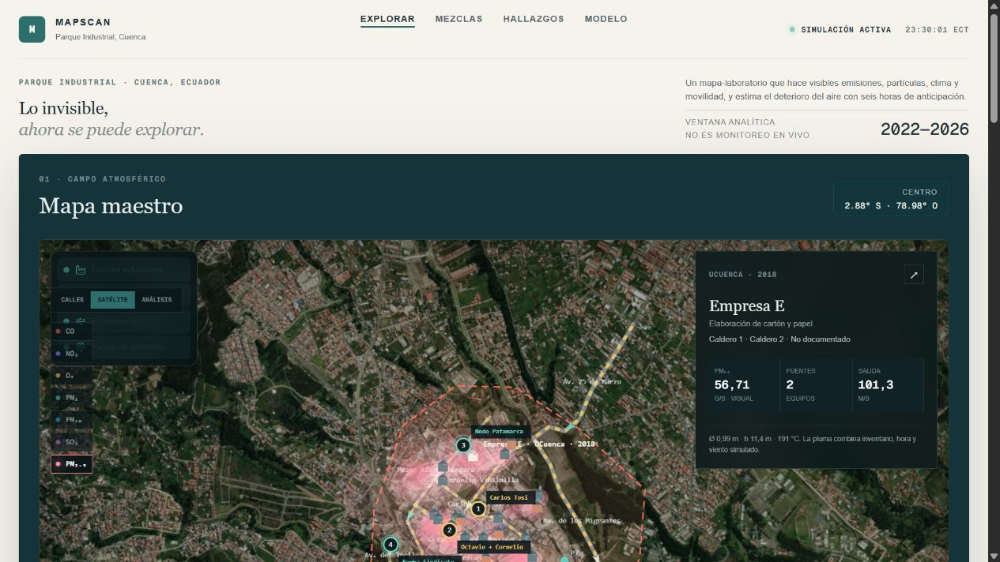
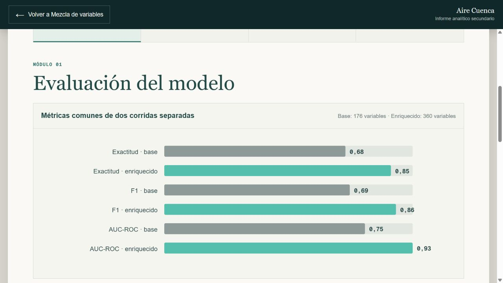

# MapScan

Sistema de análisis y predicción orientado a anticipar el deterioro de la calidad del aire, con énfasis en concentraciones de **PM2.5** y una ventana de predicción de hasta **6 horas**.

## Demo web

[Explorar la aplicación publicada](https://seashell-app-zrcfw.ondigitalocean.app/)

## Vista previa

## Resultados reportados

Los metadatos de [`public/app-data.json`](public/app-data.json) registran los siguientes resultados del modelo enriquecido:

| Indicador | Valor reportado |
| --- | ---: |
| AUC-ROC | 0,926161 |
| F1 | 0,863913 |
| Exactitud | 0,845027 |
| Variables | 360 |
| Árboles | 300 |
| Muestras de entrenamiento | 5.185 |
| Horizonte de predicción | 6 horas |

El periodo indicado en esos metadatos es del 27 de enero de 2022 al 17 de julio de 2026. Son resultados históricos exportados por el proyecto, no una validación independiente ni una nueva ejecución del entrenamiento. El AUC-ROC no equivale al porcentaje de predicciones correctas.

La demo es una simulación analítica con datos históricos: no representa sensores en vivo ni sustituye una alerta oficial. Las métricas del modelo base y del enriquecido corresponden a corridas distintas; la comparación no demuestra por sí sola una mejora bajo un protocolo de evaluación idéntico.

## Reproducibilidad

La interfaz consume archivos JSON ya exportados. [`scripts/export_site_data.py`](scripts/export_site_data.py) utiliza datos y modelos de carpetas externas al repositorio, incluidas `modelo_original/` y `modelo2/`. Esos insumos no están incluidos en esta versión pública, por lo que todavía no se puede reproducir el entrenamiento ni verificar sus métricas desde una copia de este repositorio solamente.

## Objetivo

MapScan fue desarrollado como proyecto de titulación para explorar cómo datos ambientales y meteorológicos pueden utilizarse para construir modelos predictivos que apoyen el monitoreo de la calidad del aire.

## Datos analizados

El proyecto trabaja con variables de contaminación y meteorología, entre ellas:

- PM2.5, PM10 y PM1
- CO, NO₂, O₃ y SO₂
- Temperatura
- Humedad
- Presión atmosférica

Los datos utilizados corresponden a estaciones de monitoreo de la ciudad de Cuenca, Ecuador, incluyendo información asociada al sector del Parque Industrial.

## Enfoque

El flujo general del proyecto contempla:

1. Integración y preparación de datos ambientales.
2. Limpieza y transformación de variables.
3. Construcción de una variable objetivo para identificar deterioro de la calidad del aire.
4. División temporal de los datos para evitar fuga de información.
5. Entrenamiento y evaluación de modelos de aprendizaje automático.
6. Presentación de resultados mediante una interfaz web.

## Tecnologías

- Python
- Apache Spark / Spark MLlib
- Machine Learning
- TypeScript / React
- Next.js
- Análisis y visualización de datos

## Estructura del repositorio

- `app/`: interfaz y lógica de la aplicación web.
- `db/` y `drizzle/`: estructura relacionada con persistencia de datos.
- `extraccion_academica/`: recursos de extracción y procesamiento usados durante el proyecto.
- `fuentes_academicas/`: material y referencias utilizadas durante el desarrollo.
- `public/`: recursos estáticos de la aplicación.

## Estado

Proyecto académico de titulación desarrollado en 2026.

---

**Autora:** Evelyn Criollo  
Tecnología en Big Data — Cuenca, Ecuador
